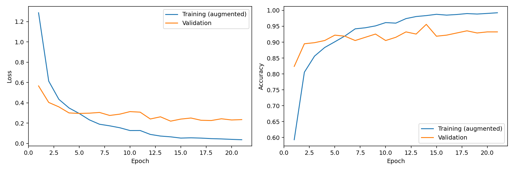
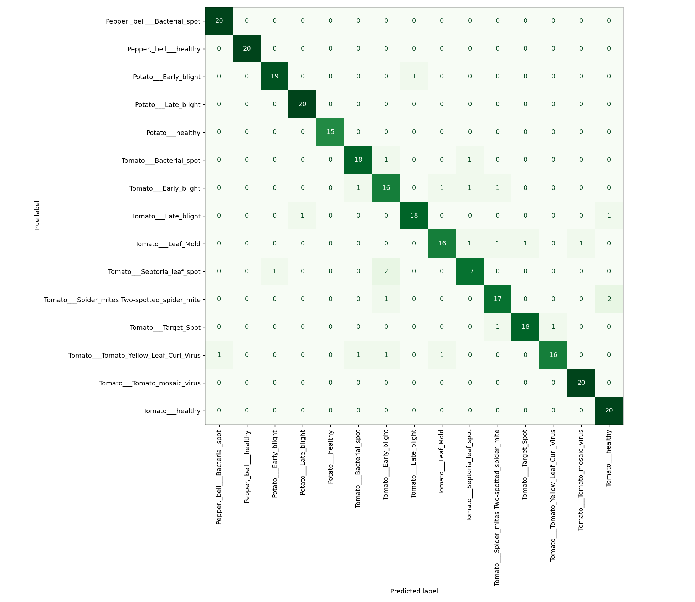
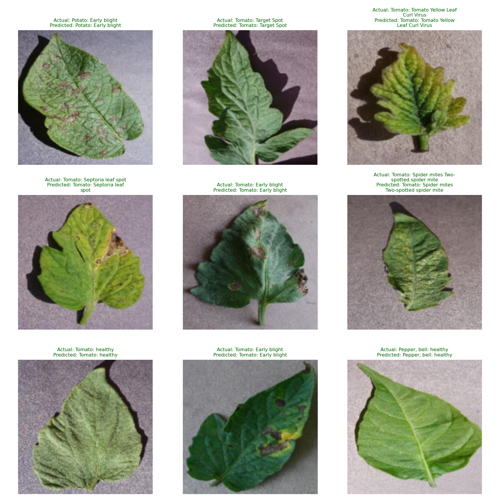

# Verified experiment results

## Scope

This is a completed local educational prototype: downloaded dataset, trained/exported model, independent saved-model evaluation, and tested Streamlit demonstration. It is not a field-validated diagnostic system or a public deployment.

Source: https://github.com/spMohanty/PlantVillage-Dataset

Pinned revision: `7f7ecc7e1eaca78107e3affe7cb5abd9427e139a`. Sampling: up to 200 images per class, seed 42. All images in this run were valid and no exact decoded-pixel duplicates were found in the audit.

## Measured results

| Measure | Result |
|---|---:|
| Classes | 15 |
| Original sampled images | 2,952 |
| Training images | 2,362 |
| Validation images | 295 |
| Held-out test images | 295 |
| Test accuracy | 91.53% |
| Macro F1 | 0.9160 |
| Weighted F1 | 0.9146 |
| Majority-class test baseline | 6.78% |
| Best epoch (validation loss) | 14 |
| Epochs run | 21 |
| Misclassified test images | 25 |

Each training image also produced one augmented feature vector; augmentation did not increase the number of independent source images. The ImageNet backbone was frozen, and only the dense head was trained. Test data was used after validation-based epoch selection.

## Error analysis

The three lowest-recall classes in this test sample:

| Class | Precision | Recall | F1 | Test images |
|---|---:|---:|---:|---:|
| Tomato___Early_blight | 76.2% | 80.0% | 0.780 | 20 |
| Tomato___Leaf_Mold | 88.9% | 80.0% | 0.842 | 20 |
| Tomato___Tomato_Yellow_Leaf_Curl_Virus | 94.1% | 80.0% | 0.865 | 20 |

Examples to inspect before the interview (first errors in the recorded deterministic test order):

- `Potato___Early_blight/7ba072ea-9bb3-4b5e-8fff-82758ff3f722___RS_Early.B 8262.JPG`: actual **Potato___Early_blight**, predicted **Tomato___Late_blight** (model score 76.7%).
- `Tomato___Bacterial_spot/7236e643-bb0f-475e-8bb6-41981fc696f4___UF.GRC_BS_Lab Leaf 8747.JPG`: actual **Tomato___Bacterial_spot**, predicted **Tomato___Septoria_leaf_spot** (model score 86.2%).
- `Tomato___Bacterial_spot/7eb976bd-5203-44c2-85ab-f27a5852a7db___GCREC_Bact.Sp 3360.JPG`: actual **Tomato___Bacterial_spot**, predicted **Tomato___Early_blight** (model score 77.1%).
- `Tomato___Early_blight/81c427f2-5e52-43e2-a000-0a2a973e18f6___RS_Erly.B 7769.JPG`: actual **Tomato___Early_blight**, predicted **Tomato___Spider_mites Two-spotted_spider_mite** (model score 54.3%).
- `Tomato___Early_blight/3a54f866-42a6-4ad8-8752-97c62aa1bc18___RS_Erly.B 6485.JPG`: actual **Tomato___Early_blight**, predicted **Tomato___Leaf_Mold** (model score 90.4%).

## Verification

- Independent evaluation of the exported model reproduced the recorded test accuracy.
- All 4 software/integration tests passed with none skipped, including the Streamlit held-out-image prediction flow.
- Saved-model reload matched the training pipeline's probability vector on a test example.
- Notebook code syntax passed. The notebook is a runnable interface to the maintained modules; it was not separately retrained.
- The environment dependency check passed.

Full machine-readable evidence: `metrics.json`, `verification.json`, `split.json`, and `test_predictions.json` under `artifacts/planthealth`. Model SHA-256: `ffa2ab906c9412517a9245ebcc02c8e36d62bfcdd127a8b7f02e5cf1f26fdf1d`.

## Resume sentence

Built a 15-class plant-leaf classifier using MobileNetV2 transfer learning and Streamlit, achieving 91.53% accuracy and 0.916 macro F1 on 295 held-out images from a 2,952-image PlantVillage sample.

Use the sentence only if you can explain and demonstrate the work. Describe the supplied notebook as the starting point and your own contributions accurately. The old 94.95% notebook result is not used or claimed here.

The sample is relatively balanced and has controlled backgrounds. This small image-level test is not evidence of farm-level generalization; related leaves and near-duplicates may remain. Model scores are not calibrated diagnostic confidence.
